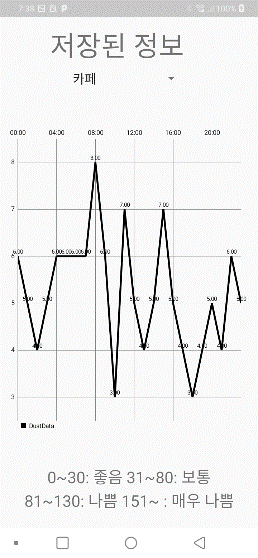

# 스마트 미세먼지 측정기

## [프로젝트 소개]

- 호흡기 질환자들이 다양한 장소에 대해 먼지 정보를 알지 못한다는 점에 착안하여 진행된 프로젝트입니다.
- 해당 기기를 휴대하여 직장, 집, 학교와 같이 주로 활동하는 장소에 대한 대기 정보를 측정하여 나쁜 경우 스마트폰을 통해 알림을 줍니다.
- 장소 별로 정보가 기록되어 장소 별 시간에 대해 통계를 확인할 수 있습니다.

## [화면]

### 메인 화면

### 통계 화면

### 장소 등록
 

## [기능블록도]

## [역할]

- 팀원
- 안드로이드, 라즈베리파이 간 블루투스 연결 담당
- 센서 정보를 처리하고 저장하는 로직을 구현

## [어려운 점]

- 안드로이드와 라즈베리파이 간 블루투스 연결에 시간이 많이 잡혀 디자인을 꾸미기가 어려웠습니다.
- 처음 접하는 앱개발이라 어플리케이션 화면 구성할 때 많은 어려움을 겪었습니다.

## [개선할 점]

- 사용자가 쓰기 좋게하기 위해서는 UI도 중요하지만 UX도 중요하다는 것을 느껴, 사용자가 사용하는 방식을 중점으로 하여 스토리보드 작성이 필요하다는 것을 깨달았습니다.
- Figma나 Oven과 같은 Tool을 통하여 ProtoType을 개발하고 진행하는 것이 화면을 구성할 때 더 빠른 개발이 될 수 있음을 느꼈습니다.
- 패키지 구조의 개선이 필요함을 느꼈습니다.
